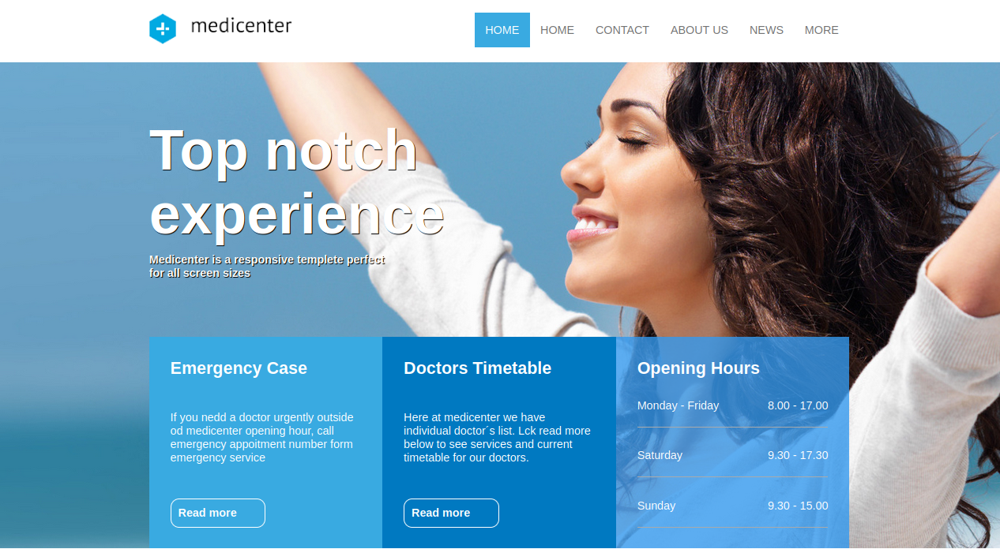
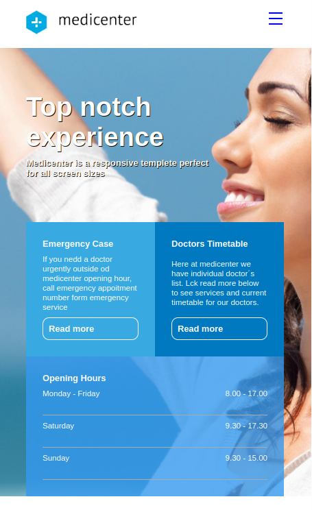

<!-- Improved compatibility of back to top link: See: https://github.com/ednaldoCS/medicenter-template/pull/73 -->
<a name="readme-top"></a>
<!--
*** Thanks for checking out the medicenter-template. If you have a suggestion
*** that would make this better, please fork the repo and create a pull request
*** or simply open an issue with the tag "enhancement".
*** Don't forget to give the project a star!
*** Thanks again! Now go create something AMAZING! :D
-->


<!-- PROJECT SHIELDS -->
<!--
*** I'm using markdown "reference style" links for readability.
*** Reference links are enclosed in brackets [ ] instead of parentheses ( ).
*** See the bottom of this document for the declaration of the reference variables
*** for contributors-url, forks-url, etc. This is an optional, concise syntax you may use.
*** https://www.markdownguide.org/basic-syntax/#reference-style-links
-->
[![Contributors][contributors-shield]][contributors-url]
[![Forks][forks-shield]][forks-url]
[![Stargazers][stars-shield]][stars-url]
[![Issues][issues-shield]][issues-url]
<!-- [![MIT License][license-shield]][license-url] -->
[![LinkedIn][linkedin-shield]][linkedin-url]


 
<!-- PROJECT LOGO -->
<br />
<div align="center">
  <a href="https://github.com/ednaldoCS/medicenter-template">
    
  </a>

  <h3 align="center">Medicenter-Home Page - Template</h3>

  <p align="center">
    An complete responsive website
    <br />
    <a href="https://github.com/ednaldoCS/medicenter-template"><strong>Explore the docs »</strong></a>
    <br />
    <br />
    <a href="https://ednaldocs.github.io/medicenter-template/ ">View Demo</a>
    ·
    <a href="https://github.com/ednaldoCS/medicenter-template/issues">Report Bug</a>
    ·
    <a href="https://github.com/ednaldoCS/medicenter-template/issues">Request Feature</a>
  </p>
</div>


<!-- TABLE OF CONTENTS -->
<details>
  <summary>Table of Contents</summary>
  <ol>
    <li>
      <a href="#about-the-project">About The Project</a>
      <ul>
        <li><a href="#built-with">Built With</a></li>
      </ul>
    </li>
    <li>
      <a href="#getting-started">Getting Started</a>
      <ul>
        <li><a href="#prerequisites">Prerequisites</a></li>
        <!-- <li><a href="#installation">Installation</a></li> -->
      </ul>
    </li>
    <li><a href="#usage">Usage</a></li>
    <li><a href="#roadmap">Roadmap</a></li>
    <li><a href="#contributing">Contributing</a></li>
    <li><a href="#license">License</a></li>
    <li><a href="#contact">Contact</a></li>
    <!-- <li><a href="#acknowledgments">Acknowledgments</a></li> -->
  </ol>
</details>


<!-- ABOUT THE PROJECT -->
## About The Project
<p>
  Full responsive web site using Flexbox
</p>

### Large Devices


### Small Devices


<p align="right">(<a href="#readme-top">back to top</a>)</p>


### Built With

This section should list any major frameworks/libraries used to bootstrap your project. Leave any add-ons/plugins for the acknowledgements section. Here are a few examples.

* [HTML](https://www.w3schools.com/html/)
* [CSS](https://www.w3schools.com/css/)

<p align="right">(<a href="#readme-top">back to top</a>)</p>


<!-- GETTING STARTED -->
## Getting Started
### Prerequisites
* Code editor
* Browser

### Installation
1. Clone the repo
   ```sh
   git clone https://github.com/ednaldoCS/medicenter-template.git
   ```
2. Open in code editor to change layout/style
3. Open in browser

<p align="right">(<a href="#readme-top">back to top</a>)</p>


<!-- USAGE EXAMPLES -->
<!-- ## Usage

Use this space to show useful examples of how a project can be used. Additional screenshots, code examples and demos work well in this space. You may also link to more resources.

_For more examples, please refer to the [Documentation](https://example.com)_

<p align="right">(<a href="#readme-top">back to top</a>)</p>
 -->


<!-- ROADMAP -->
## Roadmap

- [x] Home page  
- [x] Responsive
- [ ] Contact page
- [ ] About page
- [ ] News page
- [ ] More page
- [ ] Dinamic website

<!-- See the [open issues](https://github.com/ednaldoCS/medicenter-template)
 -->
<p align="right">(<a href="#readme-top">back to top</a>)</p>


<!-- CONTRIBUTING -->
## Contributing

Contributions are what make the open source community such an amazing place to learn, inspire, and create. Any contributions you make are **greatly appreciated**.

If you have a suggestion that would make this better, please fork the repo and create a pull request. You can also simply open an issue with the tag "enhancement".
Don't forget to give the project a star! Thanks again!

1. Fork the Project
2. Create your Feature Branch (`git checkout -b feature/AmazingFeature`)
3. Commit your Changes (`git commit -m 'Add some AmazingFeature'`)
4. Push to the Branch (`git push origin feature/AmazingFeature`)
5. Open a Pull Request

<p align="right">(<a href="#readme-top">back to top</a>)</p>


<!-- LICENSE -->
## License

Distributed under the MIT License.

<p align="right">(<a href="#readme-top">back to top</a>)</p>


<!-- CONTACT -->
## Contact
[Ednaldo Cavalcante](https://www.linkedin.com/in/ednaldo-cavalcante-3415161ab/)

[Project Link](https://github.com/ednaldoCS/medicenter-template)

<p align="right">(<a href="#readme-top">back to top</a>)</p>


<!-- ACKNOWLEDGMENTS -->
## Acknowledgments

Use this space to list resources you find helpful and would like to give credit to. I've included a few of my favorites to kick things off!

* [Choose an Open Source License](https://choosealicense.com)
* [GitHub Emoji Cheat Sheet](https://www.webpagefx.com/tools/emoji-cheat-sheet)
* [Malven's Flexbox Cheatsheet](https://flexbox.malven.co/)
* [Malven's Grid Cheatsheet](https://grid.malven.co/)
* [Img Shields](https://shields.io)
* [GitHub Pages](https://pages.github.com)
* [Font Awesome](https://fontawesome.com)
* [React Icons](https://react-icons.github.io/react-icons/search)

<p align="right">(<a href="#readme-top">back to top</a>)</p>


<!-- MARKDOWN LINKS & IMAGES -->
<!-- https://www.markdownguide.org/basic-syntax/#reference-style-links -->
[contributors-shield]: https://img.shields.io/github/contributors/ednaldoCS/medicenter-template.svg?style=for-the-badge
[contributors-url]: https://github.com/ednaldo/medicenter-template/graphs/contributors
[forks-shield]: https://img.shields.io/github/forks/ednaldoCS/medicenter-template.svg?style=for-the-badge
[forks-url]: https://github.com/ednaldoCS/medicenter-template/network/members
[stars-shield]: https://img.shields.io/github/stars/ednaldoCS/medicenter-template.svg?style=for-the-badge
[stars-url]: https://github.com/ednaldoCS/medicenter-template/stargazers
[issues-shield]: https://img.shields.io/github/issues/ednaldoCS/medicenter-template.svg?style=for-the-badge
[issues-url]: https://github.com/ednaldoCS/medicenter-template/issues
[license-shield]: https://img.shields.io/github/license/ednaldoCS/medicenter-template.svg?style=for-the-badge
[license-url]: https://github.com/ednaldoCS/medicenter-template/blob/master/LICENSE.txt
[linkedin-shield]: https://img.shields.io/badge/-LinkedIn-black.svg?style=for-the-badge&logo=linkedin&colorB=555
[linkedin-url]: https://www.linkedin.com/in/ednaldo-cavalcante-3415161ab
[product-screenshot]: images/screenshot.png
[Next.js]: https://img.shields.io/badge/next.js-000000?style=for-the-badge&logo=nextdotjs&logoColor=white
[Next-url]: https://nextjs.org/
[React.js]: https://img.shields.io/badge/React-20232A?style=for-the-badge&logo=react&logoColor=61DAFB
[React-url]: https://reactjs.org/
[Vue.js]: https://img.shields.io/badge/Vue.js-35495E?style=for-the-badge&logo=vuedotjs&logoColor=4FC08D
[Vue-url]: https://vuejs.org/
[Angular.io]: https://img.shields.io/badge/Angular-DD0031?style=for-the-badge&logo=angular&logoColor=white
[Angular-url]: https://angular.io/
[Svelte.dev]: https://img.shields.io/badge/Svelte-4A4A55?style=for-the-badge&logo=svelte&logoColor=FF3E00
[Svelte-url]: https://svelte.dev/
[Laravel.com]: https://img.shields.io/badge/Laravel-FF2D20?style=for-the-badge&logo=laravel&logoColor=white
[Laravel-url]: https://laravel.com
[Bootstrap.com]: https://img.shields.io/badge/Bootstrap-563D7C?style=for-the-badge&logo=bootstrap&logoColor=white
[Bootstrap-url]: https://getbootstrap.com
[JQuery.com]: https://img.shields.io/badge/jQuery-0769AD?style=for-the-badge&logo=jquery&logoColor=white
[JQuery-url]: https://jquery.com 
